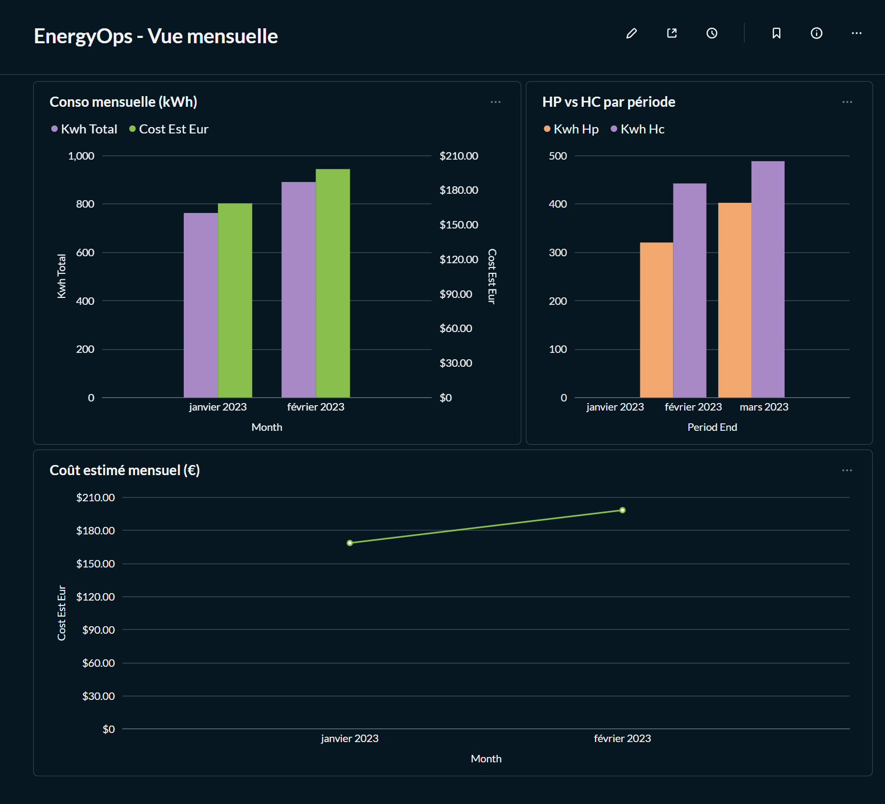

# EnergyOps — Suivi conso électricité (CSV fournisseur → Postgres → dbt → Metabase)

Projet personnel **EnergyOps** : automatiser le suivi de consommation électrique à partir d’un export CSV fournisseur, en construisant une mini-plateforme data **reproductible** (Docker) avec **ingestion → stockage → modélisation dbt → tests → dashboard Metabase**.

---

## 🎯 Objectifs
- Centraliser et historiser mes relevés mensuels (HP/HC)
- Calculer des métriques utiles : kWh total, kWh/jour estimé, coût estimé
- Obtenir un dashboard exploitable dans la vie quotidienne (pilotage de la conso)
- Démontrer une approche “Data Engineering” : pipeline reproductible, data modeling, quality checks

---

## 🧱 Stack
- **Python** : ingestion CSV + upsert (idempotent)
- **PostgreSQL** : stockage (raw + analytics)
- **dbt** : staging/marts + tests
- **Metabase** : visualisation / dashboard
- **Docker Compose** : reproductibilité de l’environnement

---

## 🏗️ Architecture (simplifiée)

CSV fournisseur  
→ **Python ingest**  
→ `raw.supplier_meter_readings` (Postgres)

`raw.supplier_meter_readings`  
→ **dbt staging**  
→ `analytics.stg_supplier_meter_readings`

`analytics.stg_supplier_meter_readings`  
→ **dbt marts**  
→ `analytics.fct_energy_period` (par période)  
→ `analytics.agg_energy_calendar_month_est` (agrégé mensuel)

→ **Metabase dashboards**

---

## 📦 Modèles dbt (cibles)
- **`analytics.fct_energy_period`**  
  Agrégation par période de relevé : HP, HC, total, jours couverts, kWh/jour, coût estimé.
- **`analytics.agg_energy_calendar_month_est`**  
  Agrégation mensuelle (estimation) : kWh, coût, nombre de jours couverts.

---

## ✅ Qualité / Tests
- Tests dbt `not_null` sur les champs clés (staging)
- Pipeline pensé pour être **rejouable** (idempotence côté ingestion)

---

## 🚀 Démarrage rapide (Docker)
### 1) Lancer la stack
À la racine du projet :
→ `docker compose up -d`
→ `docker compose ps`
### 2) Charger un CSV (exemple)
Dépose un export CSV dans data/raw/ (ex: sample_releve_mensuelles.csv).

Puis lance le script d’ingestion (Windows PowerShell) :

→ `powershell -ExecutionPolicy Bypass -File .\scripts\run_all.ps1`
### 3) Construire les modèles dbt + lancer les tests (dans Docker)

→ `docker compose run --rm dbt run`
→ `docker compose run --rm dbt test`
### 4) Vérifier dans PostgreSQL (optionnel)

→ `docker compose exec postgres psql -U energy -d energyops -c "select count(*) from raw.supplier_meter_readings;"`
→ `docker compose exec postgres psql -U energy -d energyops -c "select * from analytics.agg_energy_calendar_month_est order by month desc limit 12;"`
### 5) Ouvrir Metabase
Metabase :

http://localhost:3001

Connexion PostgreSQL depuis Metabase :

Host : postgres

Port : 5432

Database : energyops

User : energy

Password : energy

## 🧰 Structure du repo
ingest/ : ingestion Python du CSV fournisseur

postgres/init.sql : init DB (schemas/tables)

dbt/energyops/ : projet dbt (models + tests)

docs/screenshots/ : captures Metabase pour le README / portfolio

docker-compose.yml : stack Postgres + dbt + Metabase

scripts/run_all.ps1 : pipeline local (ingest + dbt)

## 🛠️ Runbook / Troubleshooting (problèmes fréquents)
Port Metabase déjà pris (3000)
Metabase est mappé sur 3001:3000.
Si présence de conflit, changer le port hôte dans docker-compose.yml, ex:

3002:3000

Puis relancer :

→ `docker compose down`
→ `docker compose up -d`
dbt: erreur liée à un ; dans un modèle SQL
En dbt, on évite souvent les ; en fin de requête dans models/*.sql.
Supprime le ; et relance :

→ `docker compose run --rm dbt run`
PowerShell bloque l’activation / scripts
L’exécution de scripts peut être désactivée.
Utiliser :

→ `powershell -ExecutionPolicy Bypass -File .\scripts\run_all.ps1`
Docker Desktop / virtualisation
Si Docker ne démarre pas, vérifier que la virtualisation est activée (BIOS / Windows Features / WSL2).

## 📈 Idées d’évolutions
Support multi-énergies (gaz / eau) et multi-compteurs

Historisation des tarifs (HP/HC) par date d’effet

Ajout de tests dbt unique, accepted_values, relationships

Orchestration planifiée (cron/Task Scheduler) + logs structurés

Exposition métriques via API / export CSV

## 👤 Auteur
David Limoisin — Data Engineer
Projet personnel orienté industrialisation, SQL/ETL, data quality, reproductibilité.

